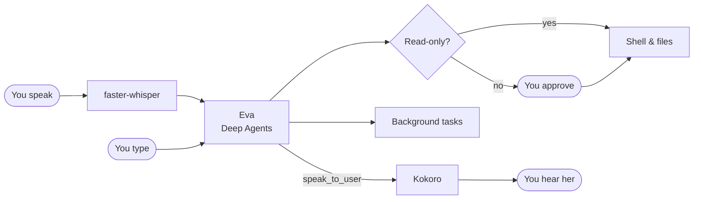

<div align="center">

# Eva

**A personal voice assistant that lives on your computer.**

[](https://github.com/Ilhe8l/eva/actions/workflows/ci.yml)
[](LICENSE)
[](https://www.python.org)
[](https://github.com/astral-sh/ruff)

[Quick start](#quick-start) · [Commands](#commands) · [Configuration](#configuration) · [How it works](#how-it-works)


<sub><i>Eva runs a background task, takes a note in her journal, and reports back. She also says her answers aloud.</i></sub>

</div>

Eva talks with you by voice or text, works with your files and shell, keeps her
own journal, runs long jobs in the background, and teaches herself new
abilities. Everything with side effects asks you first. She runs locally:
[LM Studio](https://lmstudio.ai) serves the model,
[faster-whisper](https://github.com/SYSTRAN/faster-whisper) listens, and
[Kokoro](https://github.com/hexgrad/kokoro) is her voice.

She is named after EVE (EVA in Brazil) from WALL-E.

## Highlights

- **Talks like a person.** Push-to-talk or hands-free. She chooses what to say
  aloud and leaves code and lists on screen. You can talk over her.
- **Works while you talk.** Long jobs run as background tasks, and a message sent
  mid-task reaches her at her next step, so "actually, stop" works.
- **Remembers.** A Markdown journal she organizes herself, and a conversation
  that survives restarts.
- **Grows.** She writes [skills](https://docs.langchain.com/oss/python/deepagents/skills)
  for what she cannot do yet, and edits her own code once you approve the diff
  and the tests pass.
- **Takes initiative.** After a quiet spell she checks for pending work, and she
  schedules follow-ups for herself.

## Quick start

You need Linux, Python 3.12, [uv](https://docs.astral.sh/uv/), and LM Studio
running its local server with a tool-calling model. Qwen3.5 4B fits a 6 GB
GPU next to the voice models ([settings](docs/decisions.md#a-local-setup-for-a-6-gb-gpu)).

```bash
git clone https://github.com/Ilhe8l/eva.git && cd eva
cp .env.example .env    # set EVA_MODEL to the model loaded in LM Studio
uv sync --extra voice
uv run eva --speak
```

A GPU with about 6 GB runs speech recognition and her voice together; without
one they fall back to the CPU. For text only, use `uv sync` and drop `--speak`.
You can speak any language, and Eva answers in English.

## Commands

| Command | |
| --- | --- |
| `:record` | Talk, then press Enter |
| `:listen on` / `off` | Hands-free: just talk (also `--listen`) |
| `:speak on` / `off` | Let her speak aloud |
| `:shh` | Stop talking now |
| `:stop` | Stop what she is doing |
| `:tasks` / `:cancel ID` | List or stop background tasks |
| `:auto on` / `off` | Act without asking, or ask again |
| `:help` / `:quit` | Show commands / exit |

Read-only commands (`ls`, `grep`, `git status`, ...) run right away. Anything
else waits for your approval; answer `a` to allow it for the rest of the
session. See [SECURITY.md](SECURITY.md) before turning on autonomous mode.

## Configuration

Eva reads `.env`. Models are named `provider:model`:

| Where | `EVA_MODEL` |
| --- | --- |
| LM Studio | `lmstudio:<loaded-model-id>` |
| Gemini | `google_genai:gemini-3.8-flash`, with `GEMINI_API_KEY` |
| Others | any LangChain chat model, with its provider package |

<details>
<summary>All settings</summary>

| Variable | Default | |
| --- | --- | --- |
| `EVA_MODEL` | required | Chat model, `provider:model` |
| `EVA_LM_STUDIO_URL` | `http://localhost:1234/v1` | LM Studio server |
| `EVA_WHISPER_MODEL` | `large-v3-turbo` | Speech recognition model |
| `EVA_WHISPER_COMPUTE_TYPE` | `int8_float16` | Whisper precision on the GPU (`float16` for full precision) |
| `EVA_VOICE` / `EVA_VOICE_LANGUAGE` | `af_heart` / `a` | [Kokoro voice](https://huggingface.co/hexgrad/Kokoro-82M/blob/main/VOICES.md) |
| `EVA_AUTONOMOUS` | off | Act without asking |
| `EVA_HEARTBEAT_MINUTES` | `30` | Quiet time before she checks in (`0` disables) |
| `EVA_DATA_DIR` | `.eva` | Her journal, skills, conversation and follow-ups |
| `HF_TOKEN` | none | Faster model downloads |

</details>

## How it works



Eva is a [Deep Agents](https://docs.langchain.com/oss/python/deepagents/overview)
graph wrapped in a small hexagonal core, so the domain knows nothing about
models, audio or the terminal. The details and the reasoning behind them are in
[docs/architecture.md](docs/architecture.md) and
[docs/decisions.md](docs/decisions.md).

## Development

```bash
uv sync --extra voice --extra test
uv run pytest
uv run ruff check . && uv run ruff format --check .
```

Commits follow [Conventional Commits](https://www.conventionalcommits.org), and
release-please turns them into versions and the changelog. Docker users can run
`docker compose run --rm eva`; shell commands then run inside the container.

## License

[MIT](LICENSE)
